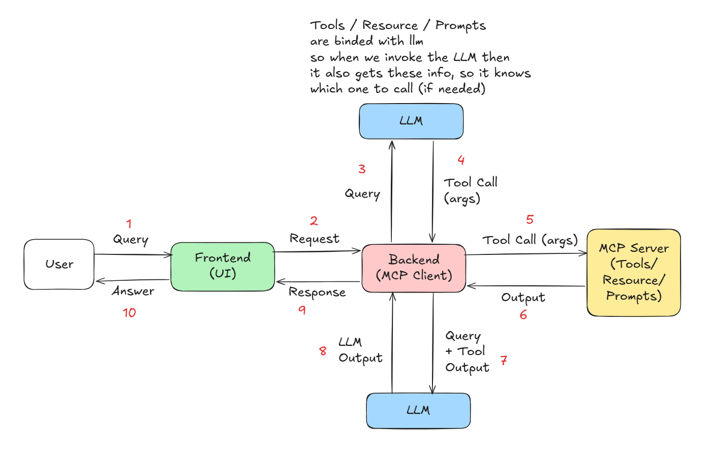
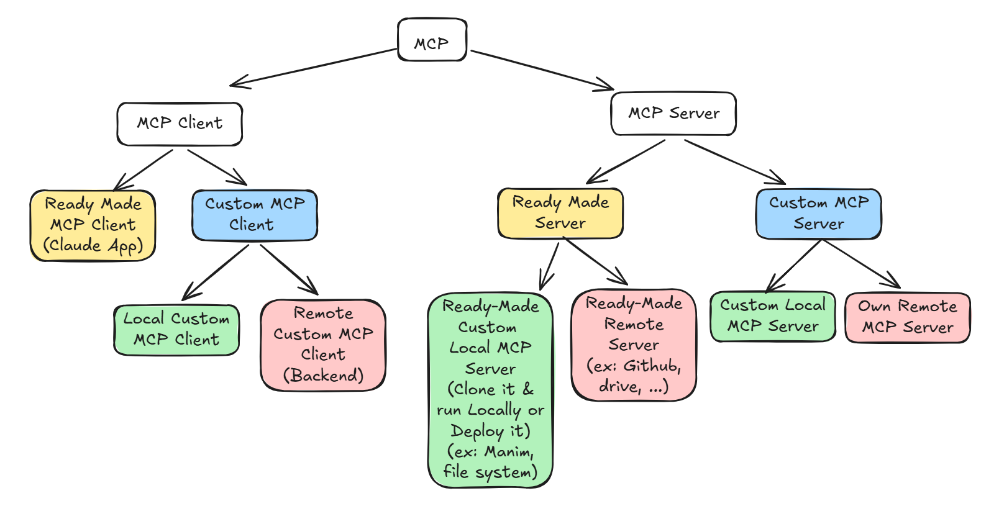
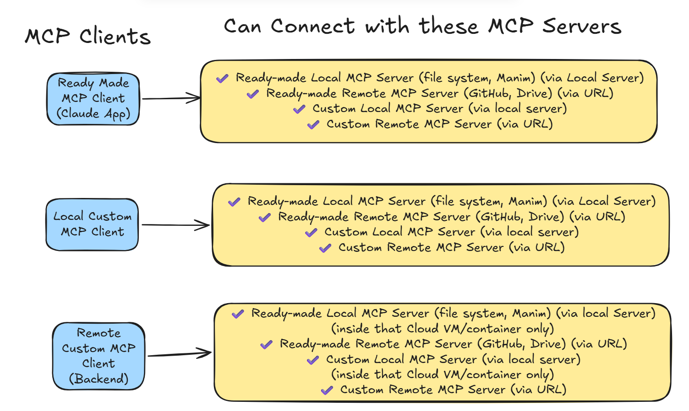

# Summary of Notes --------

<h2><a href="https://www.youtube.com/playlist?list=PLKnIA16_Rmva_oZ9F4ayUu9qcWgF7Fyc0"> Campusx MCP Playlist </a></h2>




--------

## MCP Primitives :-

Tools ->  
tools/list  
tools/call  

Resources ->
resources/list  
resources/read  
resources/subscribe /unsubscribe  

Prompts ->
prompts/list  
prompts/get 

Json RPC 2.0 (Remote Procedure Call) -> communication protocol between MCP Client and MCP Server

## Request Structure :-

```
{
    "jsonrpc": "2.0",

    "id": 123, # mention the id of the request so that when we get the response then we can match it with the request using this id.

    "method": "tool/call",
    # "tool/list"
    # "tool/call"
    # "resources/list"
    # "resources/read"
    # "resources/subscribe"
    # "resources/unsubscribe"
    # "prompts/list"
    # "prompts/get"

     "params": 
     {

        # if method is tool/list then params will be empty


        # if method is tool/call then params will have tool name and args
        "name": "tool_name",
        "args": {
            "arg1": "value1",
            "arg2": "value2"
         }

        ---------

        # if method is resources/list then params will be empty
        

        # if method is resources/read then params will have URI (unique resource identifier)
        "uri": "resource_name_or_id"
            

        # if method is resources/subscribe then use URI in params.
        "uri": "file://logs/app.log"
            
        
        # if method is resources/unsubscribe then use URI in params.
        "uri": "file://logs/app.log"

        ---------
        
        # if method is prompts/list then params will be empty


        # if method is prompts/get then params will have prompt name and other info

         "name": "prompt_name",
         "args": {
            "arg1": "value1",
            "arg2": "value2"
         }

        ---------
        # Notification -> "method": "files/updated" and params will have the info of the file updated, etc.
        No "id" needed.

        "prarms": {
            "fileId": "1234",
            "name": "app.log",
            "updatedBy": "user1",
            "timestamp": "2024-06-12T12:34:56Z"
         }

        ---------
        # if "method": "tools/progress" for streaming progress updates of long running tasks then params will have the progress info like percentage, message, etc.
        
        "params": {
            "progress": 50,
            "message": "Halfway done"
        }


     }
}
```
--------

## Response Structure :-

```
{
    "jsonrpc": "2.0",

    "id": 123, # this id should be same as the request id so that client can match the response with the request.

    "result": {

        # if the method is tool/list then result will have list of tools and their info

        "tools": [
            {
                "name": "tool_name",
                "description": "tool_description",
                # maybe args also...
                "args": {
                    "arg1": "arg1_description",
                    "arg2": "arg2_description"
                }
            },
            {
            .......
            }
            .......
        ]

        ---------

        # if the method is tool/call then result will have the output of the tool call
        "output": {
            # output of the tool call
        }

        ---------

        # if the method is resources/list then result will have list of resources and their info
        
        "resources": [
            {
                "uri": "resource_name_or_id",
                "name": "resource_name",
                "description": "resource_description"
            },
            ...
        ]

        # if the method is resources/read then result will have the content of the resource
        
        "content": {
            "uri": "resource_name_or_id",
            "test": "content of the resource"
        }

        ---------

        # if the method is resources/subscribe then result will have subscription id and other info

        "subscription_id": "subscription_id_value"


        # if the method is resources/unsubscribe then result will have unsubscription confirmation

        "unsubscribed": true

        ---------

        # if the method is prompts/list then result will have list of prompts and their info

        "prompts": [
            {
                "name": "prompt_name",
                "description": "prompt_description",
                
            },
            {
            .......
            }
            .......
        ]


        -----------

        # if the method is prompts/get then result will have prompt content and other info

        "content": {
            # content of the prompt
        }

        -----------

        # Error Response -> if there is any error in processing the request then the response will have the error field with the error code and message.
        "error": {
            "code": -32601,
            "message": "Method not found"
        }

    }

}
```


## MCP Lifecycle :-

1) Initialization Phase -> when the client connects with the server then the session is established and then both client and server do the initialization process like handshake, capability discovery, version compatibility etc.

Step 1 - Client Sends Initial Request to server

```
{
    "jsonrpc": "2.0",
    "id": 1,
    "method": "initialize",
    "params": {
        "protocolVersion": "...",
        "Capabilities":
        {
            "roots": { "listChanges": true },
            "sampling" :{}
            ....
        },
        "clientInfo": {
            "name": "claude",
            "version": "1.0"
        }
    }
}
```

Step 2 - Server Response to Client

```
{
    "jsonrpc": "2.0",
    "id": 1,
    "result": {
        "protocolVersion": "...",
        "Capabilities": {
            "tools": {
                "call": true,
                "list": true
            },
            "resources": {
                "read": true,
                "subscribe": true,
                "unsubscribe": true,
                "listChanges": true
            },
            "prompts": {
                "get": true,
                "list": true
            }
        },
        "serverInfo": {
            "name": "MCP Server",
            "version": "1.0"
        },
        "instructions": "Server is ready to accept commands"
    }
}
```

Step 3 - Client Acknowledgement to Server

```
{
    "jsonrpc": "2.0",
    "method": "notifications/initialized",

}
```

2) Operation Phase -> after the initialization phase is completed then the client and server can start communicating with each other and then the client can make requests to the server to call tools, read resources, get prompts, etc. and then the server will process those requests and give response back to the client. and also if there are any notifications or progress updates then the server can send those to the client as well.

Step 1 - Client has told that it has tools / resources / etc but still now we dont know what all tools , etc it has. so here in the step 1 it automatically asks the server that what all tools/resources/prompts you have.

Request 

```
{
    "jsonrpc": "2.0",
    "id": 2,
    "method": "tool/list"
}
```

Response 
```
{
    "jsonrpc": "2.0",
    "id": 2,
    "result": {
        "tools": [
            {
                "name": "roll_dice",
                "description": "Roll a dice n times and return the results.",
                "args": {
                    "n_dice": "number of dice to roll"
                }
            },
            {
                "name": "add_numbers",
                "description": "Add two numbers and return the result.",
                "args": {
                    "a": "first number",
                    "b": "second number"
                }
            }
        ]
    }
}
```

Step 2 - Now can call tools / resources / etc...

ex:-

```
{
    "jsonrpc": "2.0",
    "id": 3,
    "method": "tool/call",
    "params": {
        "name": "roll_dice",
        "args": {
            "n_dice": 2
        }
    }
}
``` 

Response 

```
{
    "jsonrpc": "2.0",
    "id": 3,
    "result": {
        "output": [3, 5]
    }
}
```

3) Shutdown Phase -> when the client disconnects from the server or when the server shuts down then the session is terminated and then both client and server do the cleanup process like closing connections, clearing resources, etc.

----
xtra stuff:-

Progress Notifications -> if there is any long running task then the server can send progress updates to the client using notifications. and then the client can show those progress updates to the user.

Ping -> the client can send ping request to the server to check if the server is alive or not.

Timeout -> if the server takes too much time to process the request then the client can timeout the request and give error to the user.

--------

## MCP Client -

#### 1) Ready Made MCP Client  

-> Claude Desktop App  
Connect Local / Remote MCP servers with it using Config file and direct connectors.

#### 2) Own MCP Client

using FastMCP Library. 

We can connect Our Client MCP server with Multiple LOCAL and REMOTE MCP servers Both.

Mention the Local / Remote MCP server info in the code

```
servers = {

    # Local MCP Server
    "name": 
    {
        "transport": "stdio" or "streamable_http" or "sse",

        "command": "path of the command to start the server process",

        "args": ["arg1", "arg2", ...],

        "env": {
            ....
        }

        etc....
    }, 

    # Remote MCP Server 
    "name": 
    {
        "transport": "streamable_http" or "sse",

        "url": "url of the remote mcp server",

        etc...
    }

}
```

Then tools/list , resource/list , etc to get the tools info from the server and store it.

Bind those with LLM, so that when u give a query to the LLM then the info of that tools will also be send to the LLM and then the LLM can decide which tool, or even need to use a tool or not for that query.

if it needs to call a tool then the LLM will return the tool call info with arguments.  

And then we can call those tools by ourself and store the output of it. 

Then give the tool output back to the LLM and then it will give us the final output by using that tool output info.

Ways to use the Client MCP server:--

#### 2.1) Own Local MCP Client -

We can Use this Client MCP server Locally Running it on our machine and then giving input and getting output in the terminal itself. or we can use Streamlit to Make a UI for it. 

#### 2.2) Own Remote MCP Client -

We can also put this Client MCP server on the Cloud (Remote)  
It will be on the Backend Side, So we need to make endpoints and use the Client MCP server code in those endpoints.  
So that we can call those endpoints from the Frontend side with inputs (user query,etc) and Then the Backend sees the request & performs the MCP tasks using LLM & generate output and send it back to the Frontend side.


```
SETUP - 

1) pip install uv

2) create a new folder for the client project and open it in vscode

3) open terminal and run :

uv init .   # to make the Project a uv project

uv add langchain langchain-openai langchain-mcp-adapters python-dotenv streamlit .....etc   # to install the required libraries

4) Now Write the Client code in main.py & etc..  files
- MCP servers Mention
- LLM import and bind tools
- prompt the LLM and get response with tool call info
- call the tools by ourself using the tool call info from the response
- give the tool response back to the LLM and get the final output from it.

5) Run the Client:

uv run main.py

or 

6) Deploy it on Cloud and then call the endpoints from Frontend side to use the Client MCP server functionalities.
- Frontend Hits the endpoint with user promt, etc
- Backend runs that endpoint in which the LLM gets that User query and decides whether or not to call the Tools, and in the end give final output.

```


## MCP Server

### 1) Ready Made MCP Servers

There a lot of Already made Popular MCP servers Provided by big Application like Github,etc ... so we can directly connect with it using the URL , API , tools/etc ... 

Remote Ready Made MCP Servers -> ex: Github, etc 

Local Ready Made MCP Servers -> Many Softwares (ex: Manin) has already Coded thier Local MCP Server Code. we just need to Clone it and run it locally Just like we run our -> 2.1) Own Local MCP server

Connect it with Ready Made MCP Clients like Calude, etc. 

Connect it with Own Local/Remote MCP Servers by simply using URL.

### 2) Own MCP Servers 

Using FastMCP library

We can write code Functions for Tools / resources / prompts , etc... in the Main.py
and need to mention what is it tool/resource/pompt above each Function. 

In the Function we Can Write Code to Perform a task, Calculate Something, Update the DB, etc...

Example:-

```

# tool to add a new expense entry to the database
@mcp.tool()
def add_expense(date, amount, category, subcategory="", note=""):
    '''Add a new expense entry to the database.'''
    with sqlite3.connect(DB_PATH) as c:
        cur = c.execute(
            "INSERT INTO expenses(date, amount, category, subcategory, note) VALUES (?,?,?,?,?)",
            (date, amount, category, subcategory, note)
        )
        return {"status": "ok", "id": cur.lastrowid}

```

#### 2.1) Local Own MCP server

So We can run thsi MCP server Locally using cmd `uv run main.py` and then connect with it using Ready Made Clients like Claude using cmd `uv run fastmcp install claude-desktop main.py` or config.json file. and then we can also connect it with our Own Local Client by mentioning the Server info in the Client code. and then we can use the tools/resources/prompts of this Local MCP server in our local client and also in claude app.

#### 2.2) Remote Own MCP server

We can Also Deploy the Local Own MCP server on the Cloud using FastMCP cloud or any other cloud provider and then it will become a Remote MCP server and then we can connect with it using URL in the Ready Made Clients like Claude or in our Own Client MCP server and then we can use the tools/resources/prompts of this Remote MCP server. 

```
SETUP -
1) pip install uv

2) Create a new Project folder and open it in vscode

3) open terminal and run :


uv init .   # to make the Project a uv project

uv add fastmcp    # to install the FastMCP library

uv run fastmcp version    # to check the library version

4) Now Write MCP server code in main.py file


5) Test the server 

`uv run fastmcp dev inspector main.py`

6) Run the server 

`uv run main.py`  

or  

`uv run fastmcp run main.py`  

or 

`fastmcp run server.py --transport https --host 0.0.0.0 --port 8000`


OR
Deployment  

7) So to use the FastMCP cloud for deployment we have to use github to push our code and then connect that github repo with FastMCP cloud and then deploy it on cloud.


(so in your project you will have libraries and stuff and when u push it on the FastMCP server then you need to have those libraries on that server and not only libraries
but etc stuff also . like pip install -r requirements.txt etc....  so all that part is done in the ===> Project.toml file)


# Create a new repo on Github without readme.md

git init

git add .

git commit -m "first commit"

git remote add origin https://github.com/ujwalsahu123/test-remote-mcp-server.git

git push origin main


Go to FastMCP cloud website > Deploy from your code > connect ur github account with it (first time) > select the Remote server repo > Deploy > Set Server name > Set Entry point name (the code file name in which the main code is there) (main.py) > Set Authenication (off for now) > Deploy  


Copy the Remote Server URL

now we can use the Remote Server URL
to Access the MCP server

```


-----

# MCP System Architecture :-

### MCP clinet

- Ready Made MCP Clients (Local) (Claude, etc)
- Own MCP Client (Local) -> Connect it with Local MCP server or Remote MCP server using URL
- Own MCP Client (Remote) -> Put it on Cloud (Backend) and then it can connect with Local (in that machine only) / Remote MCP servers (using URL)

----

### MCP Server

- Ready Made MCP Server (Remote) (Github, etc)
- Ready Made MCP Server (Local) (Manim, etc - Clone it and run it locally) -> Connect it with Ready Made Clients like Claude or Own Local MCP Client
- Own MCP Server (Local) -> connect with Local MCP Client or Ready Made Clients (calude)
- Own MCP Server (Remote) -> Deploy it on Cloud and then connect with Ready Made Clients like Claude or Own Local/Remote MCP Clients using URL.







-----

# MCP Application Architecture :-

MCP Sever → Has all the Tool/Resource/Prompt Functions, and it call these functions.

MCP Client → It is the one which directly talks with the LLM and it has the MCP Client code in it to call the tools/resources/prompts in the MCP server.


#### 1) Frontend (UI)

- Chat input (user query)
- API call to backend
- display LLM response
- loading / streaming UI (optional) 
- No MCP logic here

#### 2) Backend (MCP Client)

- Backend Endpoints (wrap the MCP client code in endpoints)
- LLM
- MCP Client
- Decision Loop (Agent logic). decides: answer directly or call tool
- Tool execution handler
- Response formatter
- Response to Frontend

#### 3) MCP Server (Tools & Capabilities)

- Tools / Resources / Prompts code
- Pure execution layer (no LLM)

#### Full Flow 

- User 
- ForntEnd (User Query)
- BackEnd
- LLM (decides to call tool or not)

- If No tool call 
- LLM Directly gives response
- Send response to Frontend and display to user

- If Tool call
- BackEnd calls the tool in MCP Server 
- MCP Sever Runs the tool/Functions and Sends response
- BackEnd gives tool response back to LLM
- LLM gives final response using that tool response
- Send response to Frontend and display to user


#### Example 

Frontend:  

- User: "roll a dice" → Frontend  
- Frontend → Backend

Backend:  

- User Query → MCP Client → LLM
- LLM decides: "I should call roll_dice"  
- LLM Response → MCP Client  
- MCP Client → MCP Server (tool/call roll_dice with n_dice=1)
- MCP server Response → MCP Client (result: 4)
- MCP Client → LLM (tool response: 4)
- LLM → MCP Client (final response: "You rolled a 4 🎲")
- Backend (response) → Frontend

Frontend:

- shows: "You rolled a 4 🎲"
